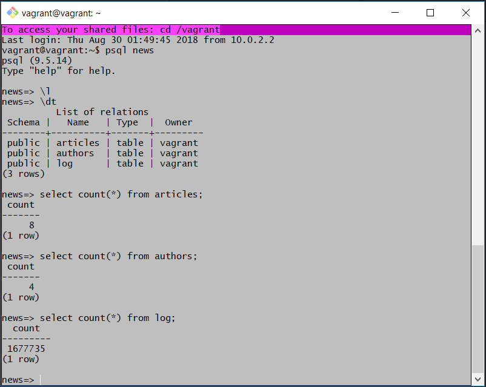
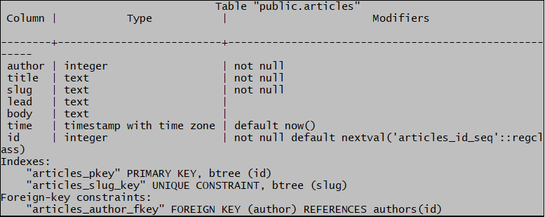
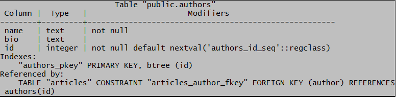
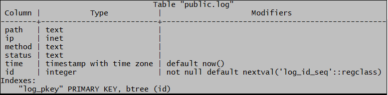
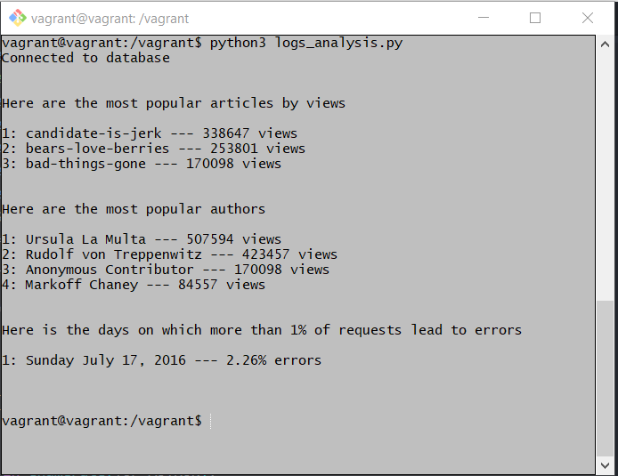

# Logs Analysis Project

This project is about connecting to a database and analysing data from a python
program using a DB-API. In this case, the database engine used is postgreSQL.
Therefore, psycopg2 has been used as DB-API to connect to the database.

## database
The database used is named 'news' and contains three tables:
articles (8 rows), authors (4 rows) and log (1677735 rows)





### Task

##### 1. What are the most popular three articles of all time?
##### 2. Who are the most popular article authors of all time?
##### 3. On which days did more than 1% of requests lead to errors?

### Preview
Here is a screenshot of my program output


### Code  
To have a glance to the code, please check the files: `logdb.py` and
`logs_analysis.py`.
<br>
Notice that I used 2 python files for readability and maintenance reasons.
In order to not repeat myself with same code blocks, I created some functions in
the `logdb.py` file and I used them in the `logs_analysis.py` file. The latter
file has 3 main sections, in the first section you can find all the SQL queries
as python strings and all the psycopg2 commands to execute those queries. In the
second section, you can find a bunch of python code which extracts the data
fetched from the database and prints the result in plain text. The last section
of the code is just to drop all SQL `views` so that you can run this program
over and over without any error.
<br>
So you don't need neither to manually create those `views` nor to manually drop
them. To have the same result like in the preview, run the file logs_analysis.py.
After running this program the database remain in the same state (unchanged).
Be aware that the code has been written using python3 syntax and that the two
files need to be in the same location. 
<br>
Please find below the SQL queries that have been used along side with the psycopg2
cursor class and execute() method to create views. For more details, refer to the
python files provided which are clear, readable and well commented.

```SQL
CREATE VIEW author_slug AS
SELECT name, slug
FROM authors, articles
WHERE authors.id = articles.author;
```
```SQL
CREATE VIEW slug_views AS
SELECT substring(path from 10) AS slug, count(path) AS views
FROM log
GROUP BY path
HAVING path IN (select '/article/' || slug from articles)
ORDER BY views desc;
```
```SQL
CREATE VIEW requests_per_day AS
SELECT time AS date, COUNT(time) AS requests
FROM (select time::date from log) as bydate
GROUP BY time;
```
```SQL
CREATE VIEW errors_per_day AS
SELECT time AS date, COUNT(time) AS errors
FROM (select time::date from log
      where status like '4%'
         or status like '5%') as bydate
GROUP BY time;
```
```SQL
CREATE VIEW errors_percent AS
SELECT errors_per_day.date,
       round(errors*100/requests::numeric, 2) AS percent
FROM errors_per_day, requests_per_day
WHERE errors_per_day.date = requests_per_day.date;
```
